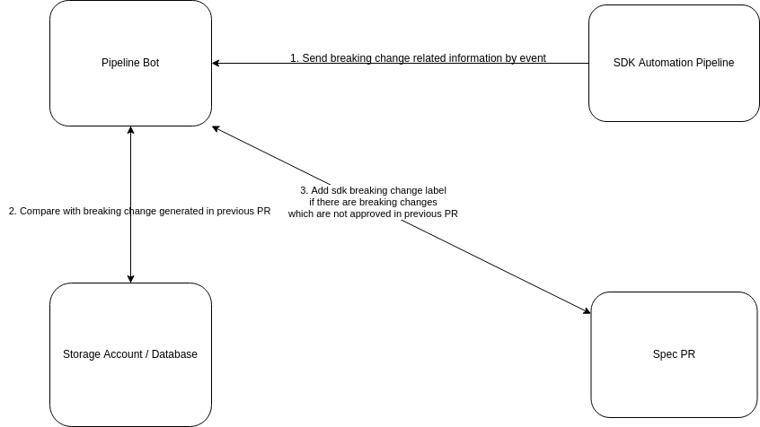

# How to Generate SDK Breaking Change in Pipeline

I raise this question because swagger reviewers are complaining the sdk breaking changes reported in a spec PR is
not caused by the spec changes in the PR. 

The sdk breaking changes in spec PR is generated by comparing the generated sdk to the latest release one.
Then there will be some breaking changes reported in spec PR, but they are caused by previous spec PR. To ignore the
sdk breaking changes generated by previous spec PR, there is a solution in existing spec unified pipeline. (_Although it
doesn't work as expected now, I'm working on it to fix its bugs._)

In the following document, I will describe the current workflow of generating sdk breaking change in spec unified pipeline,
and show you some drawbacks of current approach. Finally, I will propose a new approach, which is more general and straightforward.

## Simplified Current Workflow of Generating SDK Breaking Change in Spec Unified Pipeline 



_To make you better understand the workflow, some details are ignored in the workflow._

From the workflow, we can find the whole sdk breaking change related functionalities are in __Pipeline Bot__ and __SDK Automation Pipeline__,
which means we strongly depend on the pipeline bot. So, this workflow has the following drawbacks:
1. It's hard to reuse in other pipeline. If we want to have the sdk breaking change detection feature outside the spec unified pipeline, it's not achievable.
2. Pipeline Bot needs to compare the previous breaking change and new generated breaking change. It a string comparison, so the result
maybe uncontrolled. (__Please refer to the [appendix](#generate-sdk-breaking-change-which-is-not-approved-before-by-string-comparison) to get more details about string comparison)

## Proposed Approach

To keep core functionalities of generating sdk breaking change in a module, we need to remove the dependency on pipeline bot.
So, a new approach is proposed.


In the proposed workflow, we need to generate sdk twice in sdk automation pipeline, and then we can get the sdk breaking change
caused by the spec PR. We also can generate the breaking change by comparing to previous released sdk, which can be used in generated sdk PR. All the functionality is in sdk automation pipeline.

### Effort Estimation

| Work Item                                                          | Effort (1 day / 1 person)                                                                                                                                                               |
|--------------------------------------------------------------------|-----------------------------------------------------------------------------------------------------------------------------------------------------------------------------------------|
| Disable existing functionality in pipeline bot                     | 1                                                                                                                                                                                       |
| Support the proposed workflow in sdk automation pipeline framework | 7                                                                                                                                                                                       |
| Support the proposed workflow in JS SDK                            | 5                                                                                                                                                                                       |
| Support the proposed workflow in GO SDK                            | 5                                                                                                                                                                                       |
| Support the proposed workflow in PYTHON SDK                        | 5                                                                                                                                                                                       |
| Support the proposed workflow in JAVA SDK                          | 5? (If java sdk has breaking change generation tool, the effort will be 5. Otherwise, the effort cannot be estimated now because sdk owner needs to investigate how to implement it.)   |
| Support the proposed workflow in .Net SDK                          | 5? (If .Net sdk has breaking change generation tool, the effort will be 5. Otherwise, the effort cannot be estimated now because sdk owner needs to investigate how to implement it.)   |                                                                                                                        |


# Appendix
## Generate SDK Breaking Change which is not approved before by String Comparison
It's not friendly to show all SDK breaking changes in spec PR because the SDK breaking change maybe introduced by previous spec PR.
So, pipeline bot compares the generated SDK breaking change in sdk automation pipeline with previous approved breaking change to find the diff.
Finally, there will be only non-approved sdk breaking change shown in spec PR.

Following is an example of comparison:
1. Previous approved sdk breaking change stored in pipeline bot database:
   ```
   +	Model IpAddress no longer has parameter dns_name_label_reuse_policy
   ```
2. New generated sdk breaking change in sdk automation pipeline:
   ```
   +	Model IpAddress no longer has parameter dns_name_label_reuse_policy
   +	Model IpRoute no longer has parameter target
   ```
3. After comparison, pipeline bot shows the following breaking change in spec PR:
   ```
   +	Model IpRoute no longer has parameter target
   ```